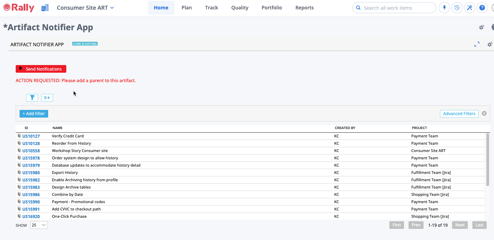

# Notification Apps

This repository contains apps that take advantage of the [@mention functionality in Rally](https://techdocs.broadcom.com/us/en/ca-enterprise-software/agile-development-and-management/rally-platform-ca-agile-central/rally/using-top/check-status/collaborate-team-members.html#concept.dita_71e53b74d8a81fe2cd74f2fc276d0d1f68d12242_mentions) to notify Rally users with a message via email (if enabled in the subscription).  

Apps in this repository:
* [Artifact Notifier App](#artifact-notifier-app)
* [Timebox Notifier App](#timebox-misalignment-notifier-app)

Instructions for installing Rally Apps using the Custom HTML app can be found here: 
https://techdocs.broadcom.com/us/en/ca-enterprise-software/agile-development-and-management/rally-platform-ca-agile-central/rally/customizing-top/use-apps/app-catalog/custom-html.html

## Artifact Notifier App

In order to get the most out of Rally visualizations and metrics at an enterprise level, the data should be governed and consistent across the organization.  Rally does not provide a way to enforce certain behaviors when creating or updating artifacts and typically the recommended course of action is to create a dashboard of items that do not meet a certain criteria to be reviewed with discussion on a regular cadence so that the items can be updated.  When this is not feasible, this app can help by providing a list of items that do not meet the configured criteria and the ability to send notifications to the users associated with those items.  

Read more details about the Artifact Notifier app [here](./artifact-notifier/README.md).  Get the app html code [here](./artifact-notifier/deploy/Ugly.txt).  

## Timebox Misalignment Notifier App

In order to get the most out of Rally visualizations and metrics at an enterprise level, the data should be governed and consistent across the organization.  Rally does not provide a way to enforce certain behaviors when creating or updating timeboxes.  The timebox misalignment notification app uses the currently selected project's timeboxes (either Iteration or Release) as a reference and looks for all timeboxes in the project scope (or workspace) that are not aligned with the name, start date and end dates.  These timeboxes will be listed in the grid and mentions added when the button is clicked.  

Read more details about the Timebox Misalignment Notifier app [here](./timebox-misalignment-notifier/README.md).  Get the app html code [here](./timebox-misalignment-notifier/deploy/Ugly.txt).  

##### NOTE: These apps are provided in an AS-IS state and should be validated by the users planning to implement them in a production environment.  These apps are not supported by the Rally Support team.  If you find an issue with the app, please report the issue via GitHub repositiory by creating a new issue.  