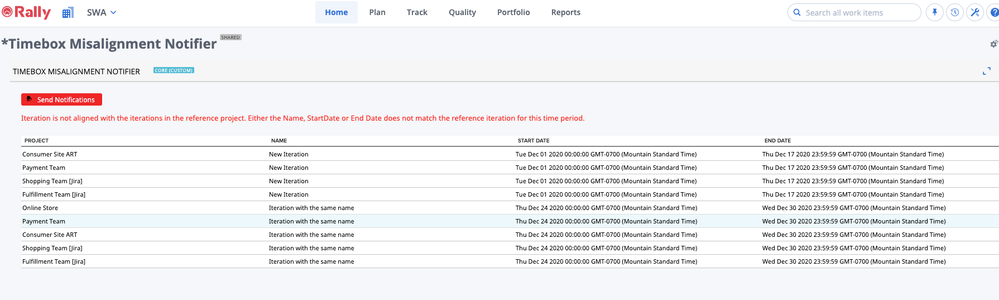
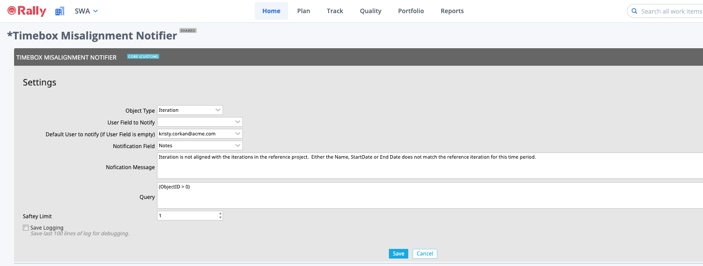

# Timebox Misalignment Notifier

In order to get the most out of Rally visualizations and metrics at an enterprise level, the data should be governed and consistent across the organization.  Rally does not provide a way to enforce certain behaviors when creating or updating timeboxes.  The timebox misalignment notification app uses the currently selected project's timeboxes (either Iteration or Release) as a reference and looks for all timeboxes in the project scope (or workspace) that are not aligned with the name, start date and end dates.  These timeboxes will be listed in the grid and mentions added when the button is clicked.  

This app makes use of the [@mention functionality in Rally](https://techdocs.broadcom.com/us/en/ca-enterprise-software/agile-development-and-management/rally-platform-ca-agile-central/rally/using-top/check-status/collaborate-team-members.html#concept.dita_71e53b74d8a81fe2cd74f2fc276d0d1f68d12242_mentions) to notify users by email via the Rally product.  

**Please be sure to read the [caveats](#caveats) below before using.**

## Summary/Description

This app provides a way to send notifications for timeboxes that are misaligned with the timeboxes in the currently selected project scope.  

When the Send Notifications button is clicked, @mentions that trigger notifications are added to each timebox that meets the query and additional filter criteria.  The @mentions are added in the field (Text field) configured in the App Settings.  

The @mention call out the user associated with the user notification field specified in the App Settings. If the user notification field does not contain a user, there is an option to specify a default user to be notified in the App Settings.

Email notifications for Rally must be enabled in the subscription for users to get an email as a result of the @mention.  

If a user is not a Workspace or Subscription administrator, the *Send Notifications* button will not be visible and users will only be able to see misaligned timeboxes, but will not have the option of updating them with notifications.  

## Configuration

The following configurations are available in the App Settings:

#### **Object Type** 
The timebox type for the notifications - either Iteration or Release

#### **User to Notify** 
The field on the artifact that contains the user to notify.  This must be a User reference field.  If a User reference field does not exist on the timebox object, then a Default User will need to be selected. 

#### **Default User to Notify**
User to notify if there is no user in the User to Notify field, or if there is not an available User to Notify field on the timebox.  

#### **Notification Field**
Field to add the @mention to.  This can be either a text field or a discussion field.  If it is a text field, then the mention will be appended to the end of the text field.  Note that if adding the mention to the text field causes the text field to exceed its max limit, then the notification may not be added.  

#### **Notification Message**
The notification message to send in the mention.  

#### **Query**
The query to identify items eligible for notification.  For the timebox notifier, this will further refine the misaligned timeboxes.  Note that adding an additional query here may result in missing misaligned timeboxes.  

#### **Saftey Limit**
This is the max number of records to update with notifications.  This is the prevent the mass accidental update of items (and mass emails) should an erroroneous query be used.  

## Caveats 
If using a text field for notifications, and appending the notification causes the text field character limit to be exceeded, then the notification may not be added and an error may occur.  

When using this app, please be conscientious about sending notifications.  This will cause emails to be sent to users on the items identified.  If the criteria is too broad, this could potentially send thousands of emails to a particular user or set of users.  Please be mindful of the impact the send notification button may have on system load and people's inboxes.  

These apps are provided in an AS-IS state and should be validated by the users planning to implement them in a production environment.  These apps are not supported by the Rally Support team.  If you find an issue with the app, please report the issue via GitHub repositiory by creating a new issue.    

### First Load

If you've just downloaded this from github and you want to do development,
you're going to need to have these installed:

 * node.js
 * grunt-cli
 * grunt-init

Since you're getting this from github, we assume you have the command line
version of git also installed.  If not, go get git.

If you have those three installed, just type this in the root directory here
to get set up to develop:

  npm install

#### Deployment & Tests

If you want to use the automatic deployment mechanism, be sure to use the
**makeauth** task with grunt to create a local file that is used to connect
to Rally.  This resulting auth.json file should NOT be checked in.

### Structure

  * src/javascript:  All the JS files saved here will be compiled into the
  target html file
  * src/style: All of the stylesheets saved here will be compiled into the
  target html file
  * test/fast: Fast jasmine tests go here.  There should also be a helper
  file that is loaded first for creating mocks and doing other shortcuts
  (fastHelper.js) **Tests should be in a file named <something>-spec.js**
  * test/slow: Slow jasmine tests go here.  There should also be a helper
  file that is loaded first for creating mocks and doing other shortcuts
  (slowHelper.js) **Tests should be in a file named <something>-spec.js**
  * templates: This is where templates that are used to create the production
  and debug html files live.  The advantage of using these templates is that
  you can configure the behavior of the html around the JS.
  * config.json: This file contains the configuration settings necessary to
  create the debug and production html files.  
  * package.json: This file lists the dependencies for grunt
  * auth.json: This file should NOT be checked in.  This file is needed for deploying
  and testing.  You can use the makeauth task to create this or build it by hand in this'
  format:
    {
        "username":"you@company.com",
        "password":"secret",
        "server": "https://rally1.rallydev.com"
    }

### Usage of the grunt file
#### Tasks

##### grunt debug

Use grunt debug to create the debug html file.  You only need to run this when you have added new files to
the src directories.

##### grunt build

Use grunt build to create the production html file.  We still have to copy the html file to a panel to test.

##### grunt test-fast

Use grunt test-fast to run the Jasmine tests in the fast directory.  Typically, the tests in the fast
directory are more pure unit tests and do not need to connect to Rally.

##### grunt test-slow

Use grunt test-slow to run the Jasmine tests in the slow directory.  Typically, the tests in the slow
directory are more like integration tests in that they require connecting to Rally and interacting with
data.

##### grunt deploy

Use grunt deploy to build the deploy file and then install it into a new page/app in Rally.  It will create the page on the Home tab and then add a custom html app to the page.  The page will be named using the "name" key in the config.json file (with an asterisk prepended).

You can use the makeauth task to create this file OR construct it by hand.  Caution: the
makeauth task will delete this file.

The auth.json file must contain the following keys:
{
    "username": "fred@fred.com",
    "password": "fredfredfred",
    "server": "https://us1.rallydev.com"
}

(Use your username and password, of course.)  NOTE: not sure why yet, but this task does not work against the demo environments.  Also, .gitignore is configured so that this file does not get committed.  Do not commit this file with a password in it!

When the first install is complete, the script will add the ObjectIDs of the page and panel to the auth.json file, so that it looks like this:

{
    "username": "fred@fred.com",
    "password": "fredfredfred",
    "server": "https://us1.rallydev.com",
    "pageOid": "52339218186",
    "panelOid": 52339218188
}

On subsequent installs, the script will write to this same page/app. Remove the
pageOid and panelOid lines to install in a new place.  CAUTION:  Currently, error checking is not enabled, so it will fail silently.

##### grunt watch

Run this to watch files (js and css).  When a file is saved, the task will automatically build, run fast tests, and deploy as shown in the deploy section above.

##### grunt makeauth

This task will create an auth.json file in the proper format for you.  **Be careful** this will delete any existing auth.json file.  See **grunt deploy** to see the contents and use of this file.

##### grunt --help  

Get a full listing of available targets.
